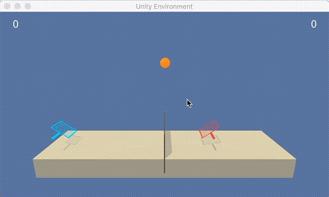
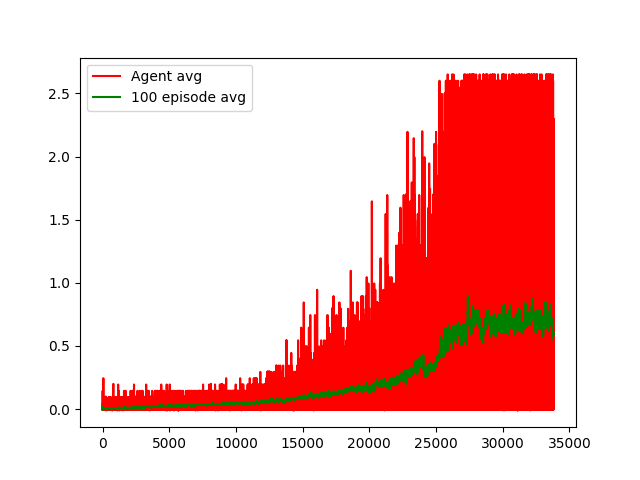

# Competition and collaboration in Reinforcement Learning

This repository is based on the competition and collaboration problem studied in the [Deep Reinforcement Learning Nanodegree program](https://github.com/udacity/deep-reinforcement-learning/tree/master/p1_navigation) and demonstrates training of a simple multi-agent system.

### General Settings (see also the original [repo](https://github.com/udacity/deep-reinforcement-learning/tree/master/p3_collab-compet))

For this project, you will work with the [Tennis](https://github.com/Unity-Technologies/ml-agents/blob/master/docs/Learning-Environment-Examples.md#tennis) environment.



In this environment, two agents control rackets to bounce a ball over a net. If an agent hits the ball over the net, it receives a reward of +0.1.  If an agent lets a ball hit the ground or hits the ball out of bounds, it receives a reward of -0.01.  Thus, the goal of each agent is to keep the ball in play.

The observation space consists of 8 variables corresponding to the position and velocity of the ball and racket. Each agent receives its own, local observation.  Two continuous actions are available, corresponding to movement toward (or away from) the net, and jumping.

The task is episodic, and in order to solve the environment, your agents must get an average score of +0.5 (over 100 consecutive episodes, after taking the maximum over both agents). Specifically,

- After each episode, we add up the rewards that each agent received (without discounting), to get a score for each agent. This yields 2 (potentially different) scores. We then take the maximum of these 2 scores.
- This yields a single **score** for each episode.

### Solving the Environment

The environment is considered solved, when the average (over 100 episodes) of those **scores** is at least +0.5.

### Getting started (see also the original [repo](https://github.com/udacity/deep-reinforcement-learning/tree/master/p3_collab-compet))

To set up your python environment to run the code in this repository, follow this steps:

1. Create (and activate) a new environment with Python 3.6.

	- __Linux__ or __Mac__:
	```bash
	conda create --name coball python=3.6
	source activate coball
	```
	- __Windows__:
	```bash
	conda create --name coball python=3.6
	activate coball
	```

3. Then install the dependencies from the requirements.txt file in this repository:
```bash
pip install requirements.txt
```

4. Download the *Unity* environment from one of the links below. You must select **only** the environment that matches your operating system:
  - Linux: [click here](https://s3-us-west-1.amazonaws.com/udacity-drlnd/P3/Tennis/Tennis_Linux.zip)
  - Mac OSX: [click here](https://s3-us-west-1.amazonaws.com/udacity-drlnd/P3/Tennis/Tennis.app.zip)
  - Windows (32-bit): [click here](https://s3-us-west-1.amazonaws.com/udacity-drlnd/P3/Tennis/Tennis_Windows_x86.zip)
  - Windows (64-bit): [click here](https://s3-us-west-1.amazonaws.com/udacity-drlnd/P3/Tennis/Tennis_Windows_x86_64.zip)

(_For Windows users_) Check out [this link](https://support.microsoft.com/en-us/help/827218/how-to-determine-whether-a-computer-is-running-a-32-bit-version-or-64) if you need help with determining if your computer is running a 32-bit version or 64-bit version of the Windows operating system.

5. Place and unzip the downloaded file into one of the following locations corresponding to your operating system:
  - **Mac**: `"coball/resources/Reacher.app"`
  - **Windows** (x86): `"coball/resources/Reacher_Windows_x86/Reacher.exe"`
  - **Windows** (x86_64): `"coball/resources/Reacher_Windows_x86_64/Reacher.exe"`
  - **Linux** (x86): `"coball/resources/Reacher_Linux/Reacher.x86"`
  - **Linux** (x86_64): `"coball/resources/Reacher_Linux/Reacher.x86_64"`
  - **Linux** (x86, headless): `"coball/resources/Reacher_Linux_NoVis/Reacher.x86"`
  - **Linux** (x86_64, headless): `"coball/resources/Reacher_Linux_NoVis/Reacher.x86_64"`

It is important that the *coball/resources* folder **_only contains the agent for your operating system_**!

6. To be able to run the `Continuous_Control.ipynb` notebook, create an [IPython kernel](http://ipython.readthedocs.io/en/stable/install/kernel_install.html) for the `coball` environment.  
```bash
python -m ipykernel install --user --name coball --display-name "coball"
```

7. Before running code in the notebook, change the kernel to match the `coball` environment by using the drop-down `Kernel` menu.

### Instructions

The main script in the repository is `coball.py`, which can be invoked to train the agent and store the result, as well as to replay the agent on a single episode from the stored learning results.

After all dependencies are set up as described in the [Getting started](#getting-started) section, the script can be invoked from the root directory of the repository as e.g.
```bash
> python coball.py --dummy
```
to show the untrained agent on a single episode,
```bash
> python coball.py --epochs 250
```
to execute learning on 250 epochs (this may take a couple of hours),
```bash
> python coball.py --show
```
to replay the trained agent on a single episode and
```bash
> python coball.py --replay
```
to run the trained agent on 100 episodes and print the obtained average score (this may take a couple of minutes).

When invoked without command line parameters, the script will execute learning on 250 epochs. For help on the possible command line options execute the script with the --help option.

### Results

The parameters of the trained models can be found in the *actor_parameters.pt* and *critic_parameters.pt* files. The scores obtained during training are plotted in the *scores.png* file.

The included results achieve the target of an average score of +0.5 over 100 episodes in about than 25000 episodes during training using a noisy policy. The trained agent, however, achieves an average score around __2.5__ when executing the policy without exploration noise.


